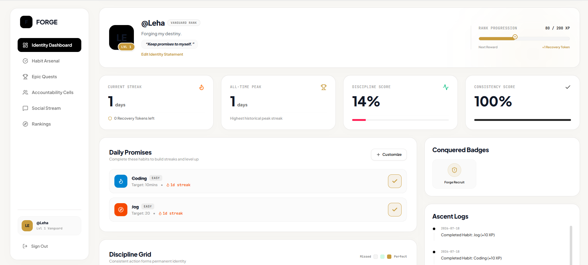

# 🚀 Forge — Identity-Driven Productivity & Social Accountability Platform

> **Build discipline through consistency, meaningful challenges, and real accountability.**

<p align="center">
  
</p>

<p align="center">
  
  
  
  
  
  
  
</p>

---

## 📖 Overview

Forge is a full-stack productivity platform that transforms habit tracking into a collaborative and engaging experience.

Instead of encouraging endless scrolling or passive engagement, Forge helps users build meaningful routines through **habit tracking, streaks, gamification, real-time collaboration, and accountability with friends**.

Whether you're learning to code, exercising daily, preparing for interviews, or building healthier routines, Forge helps turn small daily actions into long-term habits.

---

## 🎯 The Problem

Most productivity apps become abandoned checklists after a few weeks because they lack motivation and accountability.

Meanwhile, traditional social media platforms maximize engagement rather than helping users achieve meaningful goals.

Forge bridges this gap by combining productivity with social motivation, making consistency rewarding and collaborative.

---

### 💡 The Solution

Forge helps users stay consistent by combining:

- 🔥 Habit Tracking
- 🏆 Challenge System
- 👥 Accountability Circles
- 🎮 Gamification
- ⚡ Real-Time Collaboration
- 📊 Progress Analytics

Instead of measuring success through likes or followers, Forge rewards consistency, discipline, and continuous improvement.

---

# ✨ Features

### 🔥 Habit & Streak Tracking

- Create personalized daily habits
- One-click daily check-ins
- Build and maintain streaks
- Recovery Tokens to protect important streaks
- Long-term consistency tracking

---

### 🏆 Community Challenges

Participate in individual or group challenges such as:

- 30-Day Coding Challenge
- Daily Reading Challenge
- Fitness Challenge
- Morning Routine Challenge
- No Social Media Challenge

Track progress together and celebrate milestones as a team.

---

### 👥 Accountability Circles

Stay motivated with friends by creating private accountability groups.

Members can:

- Share daily progress
- Encourage teammates
- Participate in shared challenges
- Celebrate achievements
- Stay committed together

---

### 🎮 Gamified Productivity

Every completed habit contributes toward meaningful progress.

Users earn:

- XP
- Levels
- Achievement Badges
- Streak Rewards
- Milestone Unlocks

---

### ⚡ Real-Time Experience

Powered by **Socket.io**.

Receive instant updates when:

- Friends complete habits
- Someone reaches a new streak
- Challenges are completed
- Messages are sent in accountability circles

---

### 📊 Analytics Dashboard

Visualize progress through:

- Daily activity heatmaps
- Discipline score
- Consistency score
- XP progression
- Current & longest streak
- Habit completion history

---

### 🌍 Impact

Forge is designed around one simple principle:

> **Small, consistent actions lead to extraordinary long-term results.**

By combining behavioral psychology, gamification, and social accountability, Forge helps users:

- Build lasting habits
- Maintain longer streaks
- Stay accountable with friends
- Complete meaningful challenges
- Develop discipline through consistency

Rather than encouraging more screen time, Forge encourages more personal growth.

---

### 🛠 Tech Stack

| Layer | Technologies |
|--------|--------------|
| Frontend | React, TypeScript, Tailwind CSS, Vite |
| Backend | Node.js, Express.js |
| Database | MongoDB, Mongoose |
| Authentication | JWT, bcrypt.js |
| Real-Time | Socket.io |
| APIs | REST APIs |

---

## 🏗 Architecture

```text
                React Frontend
                       │
          REST API + WebSockets
                       │
              Express.js Backend
                       │
     Authentication • Habits • Challenges
        Social Features • Analytics
                       │
                   MongoDB
```

---

## 📂 Project Structure

```text
forge/
│
├── client/
├── server/
├── screenshots/
├── README.md
├── .env.example
└── package.json
```

---

## 🚀 Getting Started

## Clone the repository

```bash
git clone https://github.com/yourusername/forge.git
cd forge
```

## Install dependencies

```bash
npm install
```

## Configure environment variables

Create a `.env` file.

```env
JWT_SECRET=your_secret_key
MONGODB_URI=your_mongodb_connection_string
```

## Run the development server

```bash
npm run dev
```

---

### 🔮 Future Enhancements

- 🤖 AI-powered productivity coach
- 📅 Google Calendar integration
- 🔔 Push notifications
- 📱 Mobile application
- 📈 Advanced analytics dashboard
- 🌍 Public challenge marketplace
- 🏢 Team workspaces

---

### 🤝 Contributing

Contributions, ideas, and feature requests are always welcome.

Feel free to fork the repository and submit a pull request.

---

### 📄 License

Licensed under the MIT License.

---

### ⭐ Support

If you found this project interesting, consider giving it a ⭐ on GitHub.
